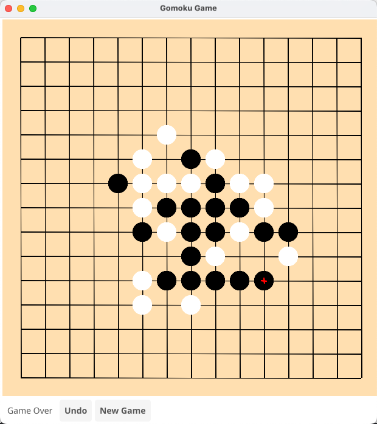

# Gomoku Game

A modern implementation of Gomoku (Five in a Row) game with an intelligent AI opponent, built using Go and the Fyne GUI toolkit.



## Game Features

- 🎮 Classic 15x15 Gomoku board
- 🤖 Three AI difficulty levels
- ↩️ Move undo functionality
- 🎯 Last move indicator
- 🔊 Sound effects for stone placement
- 🎨 Clean and intuitive user interface

## AI Difficulty Levels

### Easy Mode
- Focuses on defensive play
- Blocks immediate threats
- Suitable for beginners learning the game
- Prefers moves near the center and existing stones

### Medium Mode
- Balanced offensive and defensive strategy
- Looks for opportunities to create winning positions
- Actively blocks opponent's threats
- More challenging than Easy mode but still approachable

### Hard Mode
- Advanced offensive and defensive strategies
- Creates and recognizes complex threats
- Uses sophisticated position evaluation
- Suitable for experienced players
- Considers multiple factors including:
  - Open fours and threes
  - Double-three formations
  - Strategic board positions
  - Center control

## System Requirements

- Go 1.16 or later
- Operating System: Windows, macOS, or Linux
- Graphics: Basic graphics card supporting OpenGL 2.1 or newer

## Installation

### Prerequisites

#### macOS
```bash
brew install go gcc pkg-config
```

#### Linux (Ubuntu/Debian)
```bash
sudo apt-get install golang gcc libgl1-mesa-dev xorg-dev
```

#### Windows
1. Install Go from https://golang.org/
2. Install GCC from http://mingw-w64.org/
3. Install pkgconfig from https://chocolatey.org/packages/pkgconfig

### Building and Running

1. Clone the repository:
```bash
git clone https://github.com/yourusername/simple-gomoku.git
cd simple-gomoku
```

2. Install dependencies:
```bash
go mod download
```

3. Run the game:
```bash
go run main.go
```

## How to Play

1. Launch the game and select your preferred AI difficulty level
2. You play as Black (⚫) and move first
3. Click on any intersection point to place your stone
4. The AI (⚪) will automatically respond with its move
5. Get five stones in a row (horizontally, vertically, or diagonally) to win
6. Use the "Undo" button to take back moves
7. Start a new game at any time with the "New Game" button

## Game Controls

- **Left Click**: Place a stone
- **Undo Button**: Take back the last move (both your move and AI's response)
- **New Game Button**: Start a fresh game with difficulty selection

## Strategy Tips

1. Control the center of the board when possible
2. Watch for and block your opponent's threats
3. Try to create multiple threats simultaneously
4. Pay attention to both offensive opportunities and defensive needs
5. Avoid playing too close to the edges in the early game

## Contributing

Contributions are welcome! Please feel free to submit pull requests, report bugs, or suggest new features.

## License

This project is licensed under the MIT License - see the LICENSE file for details.

## Acknowledgments

- Built with [Fyne](https://fyne.io/) - Cross platform GUI toolkit
- Inspired by the traditional game of Gomoku/Five in a Row
